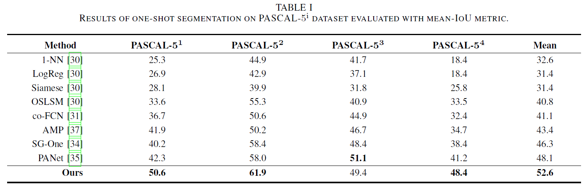

# Semantically Meaningful Class Prototype Learning for One-Shot Image Segmentation


Introduction
------------
This is the source code for our paper **Semantically Meaningful Class Prototype Learning for One-Shot Image Segmentation**

Network Architecture
--------------------
The architecture of our proposed model is as follows


### Installation
* Install PyTorch 1.4 with Python 3 

* Clone this repo
```
git clone https://github.com/chentao2016/SMCP.git
```

### Data Preparation for VOC Dataset

1. Download VOCdevkit.zip from [here](https://smcp-sh.oss-cn-shanghai.aliyuncs.com/VOCdevkit.zip),unzip and put it under `/data` folder.


### Train and test from scratch 

1. Download the ImageNet-pretrained weights of VGG16 network from `torchvision`: [https://download.pytorch.org/models/vgg16-397923af.pth](https://download.pytorch.org/models/vgg16-397923af.pth) and put it under `SMCP/pretrained_model` folder.

2. To reproduce the result reported in Table 1, run the script to train and test for set 0,1,2,3.The example for set 0 is 

```
./experiments/train_test_set_0.sh

```

### Test with our pretrained model.
1. Download our pretrained model for set 0 model using

```
wget https://smcp-sh.oss-cn-shanghai.aliyuncs.com/25000.pth

```
and put it under `runs/SMCP_VOC_sets_0_1way_1shot_[train]/1/snapshots` folder.

2. To reproduce the result reported in Table 1 (50.6 of PASCAL-5_1 ), run 
```
python test.py with gpu_id=0 mode='test' snapshot='./runs/SMCP_VOC_sets_0_1way_1shot_[train]/1/snapshots/25000.pth'
```

Experiment Results
--------------------
The experiment results on PASCAL-5i dataset
